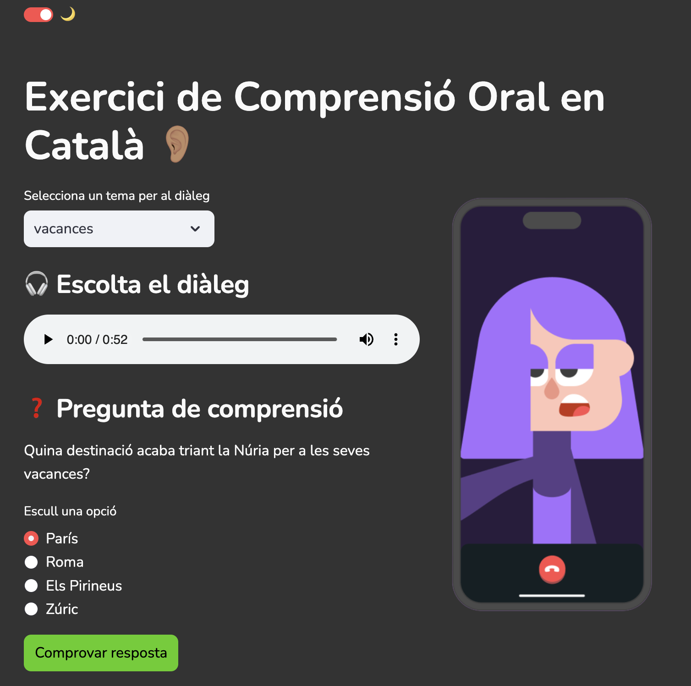

# 🎧 Exercici de Comprensió Oral en Català

Aquest és un projecte interactiu desenvolupat amb [Streamlit](https://streamlit.io/) per ajudar a la comprensió oral en català. Utilitza [AWS Polly](https://aws.amazon.com/polly/) per generar àudio sintètic dels diàlegs i ofereix preguntes de comprensió basades en el contingut escoltat.



## 📌 Requisits

Per executar aquest projecte necessites:

- Python 3.8+  
- AWS SDK (`boto3`) configurat amb credencials vàlides per a AWS Polly  
- Llibreries requerides:

  ```bash
  pip install streamlit boto3 pydub
  ```

## 🛠️ Configuració

1. **Clona aquest repositori**:

   ```bash
   git clone https://github.com/el-teu-repo.git
   cd el-teu-repo
   ```

2. **Configura les teves credencials AWS** per a AWS Polly (`~/.aws/credentials`):

   ```ini
   [default]
   aws_access_key_id=YOUR_ACCESS_KEY
   aws_secret_access_key=YOUR_SECRET_KEY
   region=us-east-1
   ```

3. **Executa l'aplicació**:

   ```bash
   streamlit run app.py --server.port 7861
   ```

## 📂 Estructura del projecte

```
📁 projecte
│── app.py                 # Fitxer principal de l'aplicació Streamlit
│── data/
│   ├── restaurant.json     # Diàleg sobre restaurants
│   ├── feina.json          # Diàleg sobre la feina
│   ├── estudis.json        # Diàleg sobre estudis
│   ├── vacances.json       # Diàleg sobre vacances
│── lilly_call.png          # Imatge decorativa per la interfície
│── requirements.txt        # Llistat de dependències
```

## 📢 Com funciona?

1. Selecciona un **tema de diàleg**.
2. Escolta l'àudio generat automàticament a partir del diàleg en català.
3. Llegeix i respon la **pregunta de comprensió**.
4. Verifica si la teva resposta és correcta.

## 📜 Llicència

Aquest projecte és de codi obert i està disponible sota la llicència [MIT](LICENSE).

🎉 **Gaudeix aprenent català!**