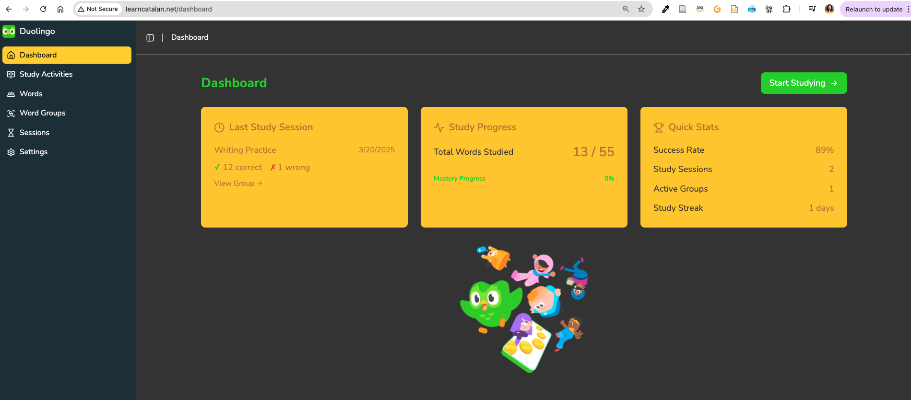
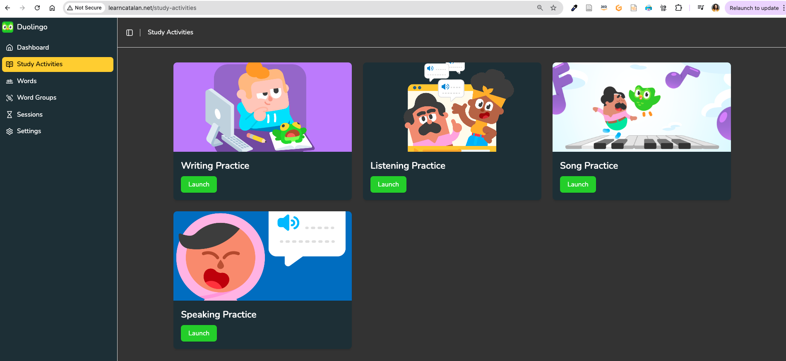
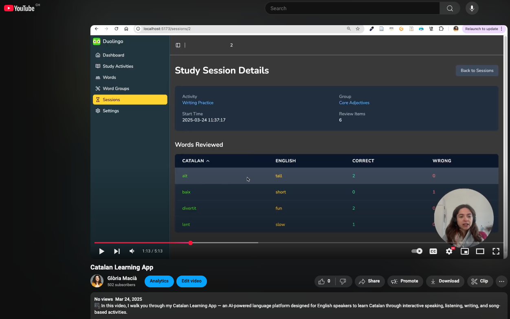
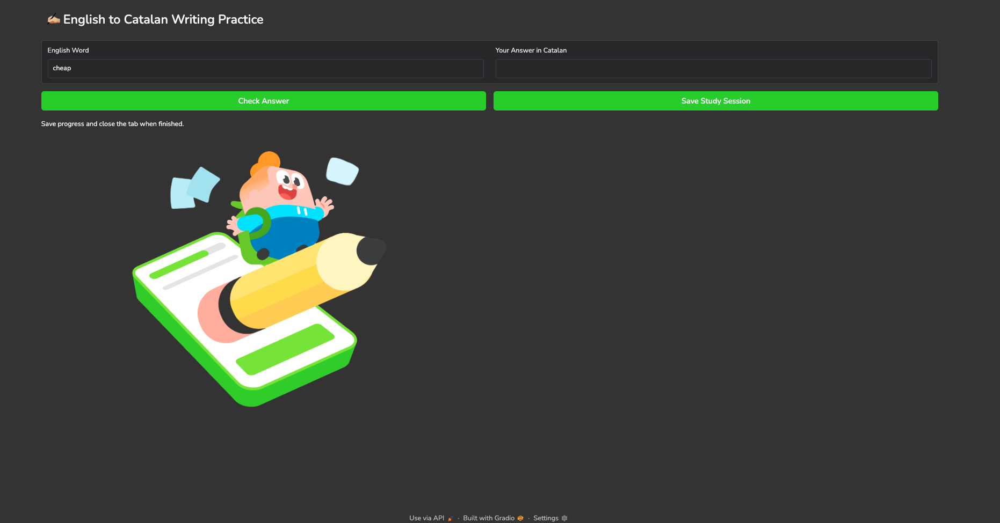
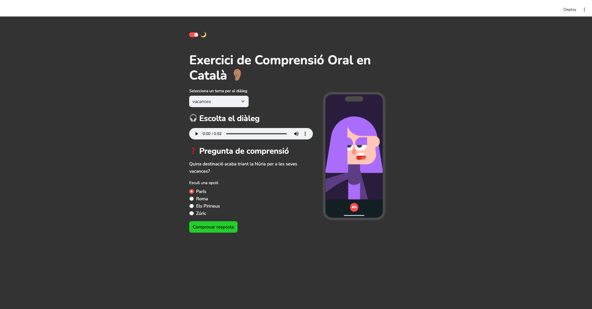
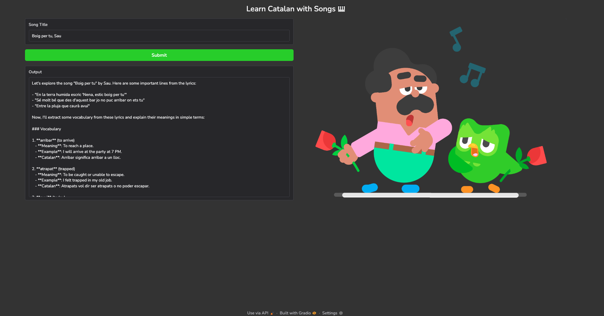
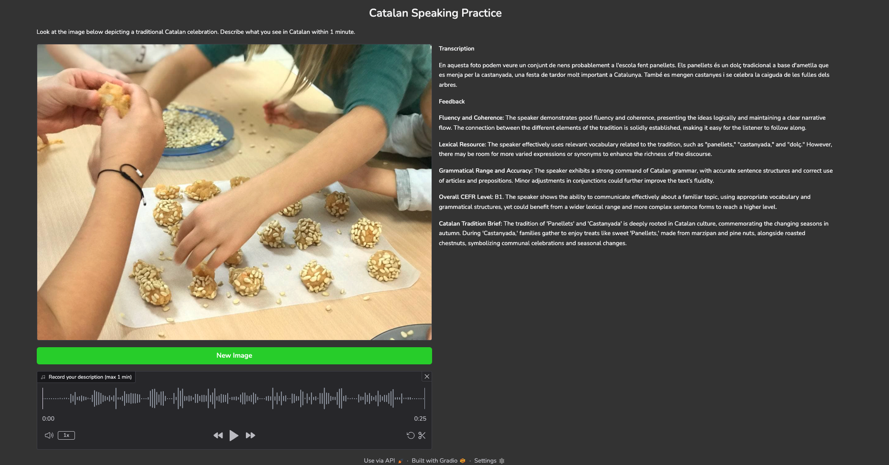

# 🚀 Free Genai Bootcamp 2025

#### Weeks Of Free Online GenAI Training And Hands-on Programming created by Andrew Brown, the team of ExamPro and amazing instructors 

---

### 🦄 Fictional Theme of the Bootcamp

Our fictional startup is building an AI-powered language learning platform designed to teach Catalan to English-speaking learners. The vision is to create an immersive, playful, and highly interactive learning experience using cutting-edge Generative AI. 

🟢 Visual inspiration is drawn from Duolingo, as a respectful homage to their mission of making language learning accessible and free for everyone. However, Duolingo currently only supports learning Catalan from Spanish, which creates a barrier for the growing number of international residents, travelers, and students who come to Barcelona and Catalonia from around the world and want to integrate locally.

🌍 Our project bridges that gap—bringing Catalan learning directly to English speakers, empowering them to better connect with the language, culture, and people of Catalonia.

--- 

### 🧑🏽‍🎓 Eager to learn Catalan? 

The Catalan learning platform is publicly accessible 

http://learncatalan.net



It offers four interactive study activities: **Writing Practice**, **Listening Practice**, **Song Practice**, and **Speaking Practice**,



Awesome! Here's a fully updated and improved version of your `### EC2 Deployment` section, now including Docker Compose, containerization, and EC2 security group setup.

---

### 🎥 Video Walkthrough
Curious to see the app in action? Check out the full walkthrough here:

[](https://youtu.be/XlG6qKArPbU)

This video showcases the features of the Catalan Learning App, including interactive activities for speaking, listening, writing, and learning through music.

---

### ✍️ Writing Practice
This app helps learners reinforce vocabulary through active recall. The learner selects a word group (e.g., adjectives), and is presented with words to translate into Catalan. After each response, the app provides immediate feedback on accuracy.

Performance data is saved to the language portal database, showing how many times each word was translated correctly—both within the current session and across past sessions.



### 🎧 Listening Practice

This app lets learners choose a dialogue topic, then generates a Catalan conversation using Anthropic’s LLM through AWS Bedrock. The dialogue is voiced using AWS Polly for a natural listening experience.
After listening, learners answer a multiple-choice question to check their comprehension.



### 🎵 Song Practice
This app helps learners explore Catalan songs interactively using an LLM-powered agent. You simply enter the title of a Catalan song (optionally with the artist), and the agent takes over using three specialized tools:

* 🔍 Search Tool – Finds the full lyrics using DuckDuckGo.
* 🧠 Vocabulary Extractor – Identifies key or challenging Catalan words.
* 💬 Word Explainer – Provides clear English definitions and example sentences.

Behind the scenes, an autonomous language model agent from OpenAI coordinates all three tools to deliver a personalized and language-rich learning experience.



⚠️ **EC2 Deployment**: DuckDuckGo may occasionally block search requests originating from EC2 instances, which can cause the app to temporarily stop working.

### 🗣️ Speaking Practice

This app helps learners improve their spoken Catalan by presenting them with images of traditional Catalan scenes and asking them to describe what they see — all within one minute. The spoken response is transcribed using OpenAI Whisper and evaluated against the CEFR framework to provide a proficiency level.



⚠️ **EC2 Deployment**:
Due to [gradio limitations](https://discuss.huggingface.co/t/microphone-access-for-a-deployed-gradio-app-on-e2/108335), the microphone cannot capture capture audio when deployed on EC2 without HTTPS. Unfortunately, adding HTTPS in Flask can be complex, as its built-in development server isn’t intended for production use and lacks native HTTPS support. 

In retrospect, a different AWS deployment option might have been more suitable than EC2, but I was unaware of this limitation when I first set sail with it and I wished to keep it simple. That said, cloud deployment was not the main focus of the bootcamp — the app works perfectly in local environments, and instructions for running it locally are provided below.

---

### 💻 Run Locally

Follow these steps to run the **Catalan Learning App** on your local machine:

#### ✅ Prerequisites

Make sure you have the following installed:

- **[Python 3.9+](https://www.python.org/downloads/)**
- **[Docker](https://docs.docker.com/get-docker/)**
- **[Docker Compose](https://docs.docker.com/compose/install/)**

---

#### 🔐 API Credentials Required

Some services require external API access:

- **OpenAI API Key** (for GPT-4o and Whisper)
- **AWS Credentials** (for Polly and other services)

Before running the app, you’ll need to create the following `.env` files:

- `./listening-practice/.env`
- `./song-vocab-openai/.env`
- `./speaking-practice/.env`

Each `.env` file should include the necessary keys. Example:

```env
OPENAI_API_KEY=your_openai_api_key
AWS_ACCESS_KEY_ID=your_aws_access_key_id
AWS_SECRET_ACCESS_KEY=your_aws_secret_access_key
```

---

#### 🧰 Step-by-Step Setup

1. **Clone the repository**
   ```bash
   git clone https://github.com/gloriamacia/free-genai-bootcamp-2025.git
   cd free-genai-bootcamp-2025
   ```

2. **Set up the backend database**
   ```bash
   cd backend-flask
   pip install invoke
   touch words.db             # Create an empty SQLite database file
   invoke init-db             # Initialize database tables
   cd ..
   ```

3. **Start the app with Docker Compose**
   ```bash
   docker compose up --build
   ```

#### 🌐 Access the App

Once running, you can visit the following URLs in your browser:

- **Frontend** → [http://localhost:5173](http://localhost:5173)  
- **Backend API** → [http://localhost:5001](http://localhost:5001)  
- **Writing Practice** → [http://localhost:7860](http://localhost:7860)  
- **Listening Practice** → [http://localhost:7861](http://localhost:7861)  
- **Song Vocabulary** → [http://localhost:7862](http://localhost:7862)  
- **Speaking Practice** → [http://localhost:7863](http://localhost:7863)

---

### ☁️ EC2 Deployment  

The application is deployed on an **Amazon EC2 instance**, using **Docker Compose** to manage and run the full multi-service setup. A **custom domain** was purchased via **AWS Route 53**, which handles DNS routing to the EC2 instance's public IP.

Before deployment, the entire app was **containerized**, with each major component — backend (Flask), frontend (React), and individual study tools (Gradio, Streamlit, etc.) — built as separate **Docker services**. These were defined and orchestrated using a `docker-compose.yml` file to ensure smooth coordination between containers.

Here's a high-level breakdown of the setup:
- 🐳 **Docker Compose** manages multiple services:
  - `backend` (Flask API with SQLite DB)
  - `frontend` (React app served via Nginx)
  - Gradio/Streamlit-based apps: `writing-practice`, `listening-practice`, `song-vocabulary`, `speaking-practice`
  
- Each app is exposed on a unique port (e.g., 7860, 7861…) and isolated in its own container.
- Environment variables and secrets are passed securely using `.env` files for services that require API credentials (e.g., AWS, OpenAI).
- Data such as the SQLite database is mounted as a volume for persistence.

🛡️ **Security Group Configuration** on EC2:
To make the app publicly accessible and ensure each microservice runs properly, the EC2 instance was configured with an appropriate **security group**, allowing inbound traffic on the required ports:
- `5173` for the frontend (React)
- `5001` for the backend (Flask)
- `7860–7863` for individual AI practice tools
- `80` and `443` (optional, for HTTP/HTTPS)

🌐 **Custom Domain with Route 53**:
- A domain was purchased via **AWS Route 53**
- An **A Record** was created in the hosted zone to point the domain to the EC2 instance’s public IPv4 address

The catalan learning language portal is publicly acessible http://learncatalan.net

---

### 🤝 Bootcamp Contributions

Beyond building the **Catalan Learning App**, I actively contributed to the wider GenAI Bootcamp community by supporting accessibility, experimenting with serverless GenAI deployments, and sharing knowledge through open-source code and video tutorials.

- 🇪🇸 **Spanish Bootcamp — Language Inclusion**  
  Contributed to launching the **Spanish-language version** of the bootcamp to promote accessibility and inclusion.Acted as **Week 1 instructor**, delivering the first sessions in Spanish.  

  📺 [Watch the video](https://www.youtube.com/watch?v=AQsbsuCPufw&ab_channel=TerraSpacio)

- ⚙️ **Running Hugging Face LLMs on Lambda using Ollama**  
  
  Built a working solution to run **LLMs via Ollama inside AWS Lambda containers**, making powerful models accessible serverlessly.  

  🔗 [GitHub Repository](https://github.com/gloriamacia/aws-lambda-deepseek-ollama-llm)  
  📺 [Watch the video](https://www.youtube.com/watch?v=MY94kiTfYdk&list=PLBfufR7vyJJ69c9MNlOKtO2w2KU5VzLJV&index=27&ab_channel=ExamPro)

- 🌐 **Gradio Web App on Lambda (with AWS CDK)**  
  Created a project that deploys a **Gradio interface** as an **AWS Lambda container** using **AWS CDK**, publicly accessible via Lambda Function URL. 

  🔗 [GitHub Repository](https://github.com/gloriamacia/gradio-on-lambda)  
  📺 Video coming soon, published by Andrew Brown

---

### 🔗 Contact

[LinkedIn – Gloria Macià](https://www.linkedin.com/in/gloriamacia/)
