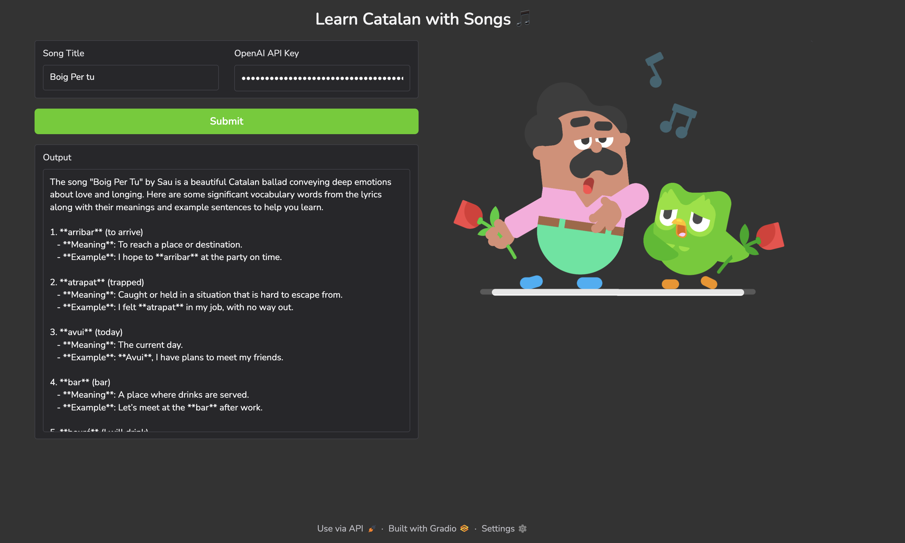

# Catalan Song Learning App

Learn new vocabulary from Catalan songs using this interactive Gradio app.



## How to Run

1. **Install dependencies**  
   Run the following command to install required packages:
   ```bash
   pip install -r requirements.txt
   ```

2. **Run the app**  
   Start the app with:
   ```bash
   python app.py
   ```

3. **Open the App**  
   Navigate to the provided URL (typically http://34.205.203.251:7860) in your browser.

## Usage

- Enter a song title and your OpenAI API key.
- Click **Submit** to view the generated output.

