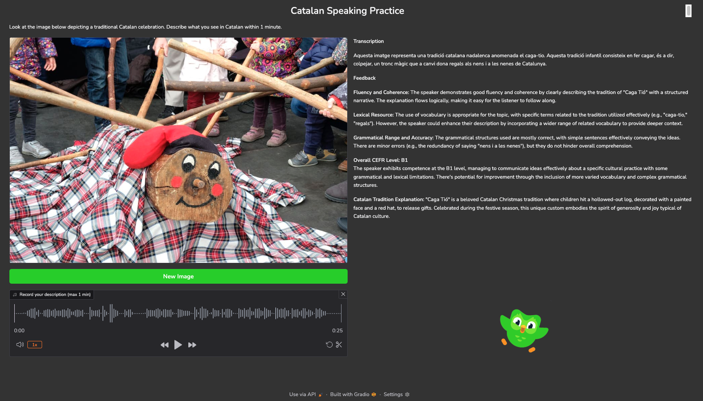

# Catalan Speaking Practice

This Gradio-based web application helps you practice speaking in Catalan by describing images of traditional Catalan celebrations. It then uses OpenAI’s Whisper model to transcribe your audio and GPT to provide feedback, including a suggested CEFR level.



## Features

1. **Random Image Selection**  
   Each session (or when you click “New Image”) a random image from a set of Catalan traditions is displayed.

2. **Audio Recording**  
   Record your voice for up to one minute describing the image in Catalan.

3. **Transcription via Whisper**  
   Your recorded audio is sent to OpenAI’s Whisper to generate a text transcription in Catalan.

4. **Evaluation and CEFR Level**  
   GPT analyzes your transcription based on Fluency & Coherence, Lexical Resource, and Grammatical Accuracy, then assigns a CEFR level (A1–C2).

5. **User-Friendly UI**  
   Gradio provides an intuitive interface, with the image on the left and the transcription and feedback on the right.

## Requirements

- Python 3.10+  
- [Gradio](https://gradio.app/)  
- [OpenAI Python Library](https://pypi.org/project/openai/)  
- [python-dotenv](https://pypi.org/project/python-dotenv/) (to load your API key from a `.env` file)

## Setup and Usage

1. **Clone this repository** (or copy the files into your project).
2. **Install dependencies**:
   ```bash
   pip install -r requirements.txt
   ```
   (Alternatively, install each package individually: `gradio`, `openai`, `python-dotenv`, etc.)
3. **Create a `.env` file** in the project folder and add your OpenAI API key:
   ```
   OPENAI_API_KEY=sk-1234abcd...
   ```
4. **Run the app**:
   ```bash
   gradio app.py
   ```
5. **Access the interface** by opening the local URL (usually http://127.0.0.1:7860) in your web browser.

## How to Use

1. When the app loads, a random image appears on the left.  
2. Click **Record your description (max 1 min)** to start recording; speak in Catalan to describe the image.  
3. Once the recording stops, the app transcribes your speech and displays the text on the right.  
4. GPT analyzes your transcription, providing feedback on your performance and suggesting a CEFR level.  
5. If you want a new image, click **New Image** and repeat the process.