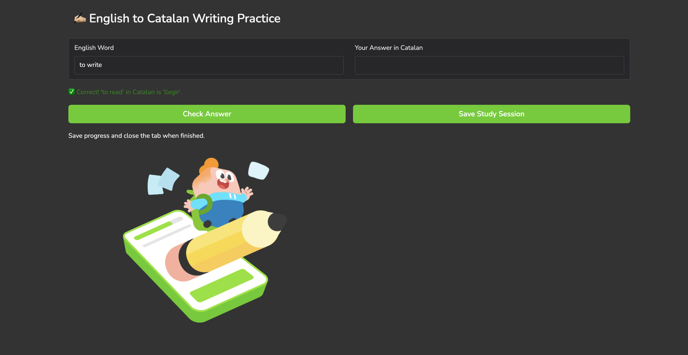
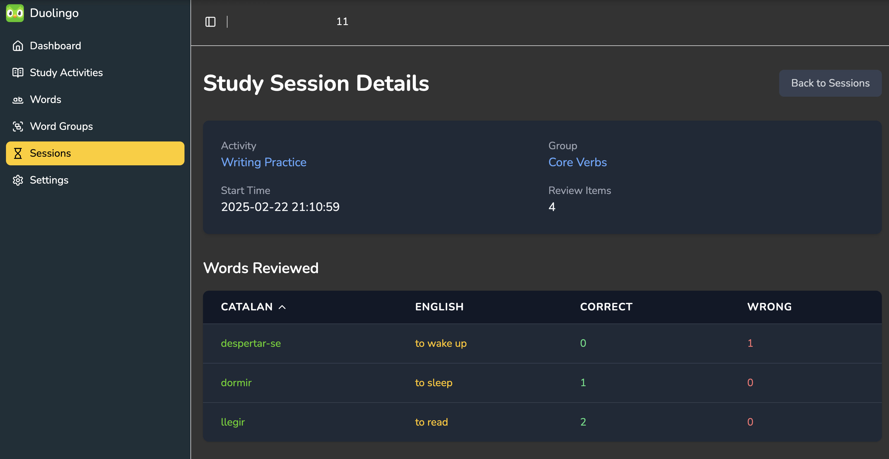

# English to Catalan Writing Practice App

This is an interactive writing practice application that helps users improve their Catalan vocabulary by translating English words. The app randomly selects a word from a chosen group and challenges the user to provide the correct Catalan translation. It checks the answer in real-time, displays immediate feedback, and allows users to save their study sessions to a Flask-based backend. 




## Features

- **Random Word Generation:**  
  On page load, the app selects a random word from a randomly chosen word group. Each new word is generated automatically after the user checks their answer.

- **Real-Time Answer Checking:**  
  Users can enter the Catalan translation for the displayed English word. The app verifies the answer and provides instant visual feedback:
  - **Correct Answer:** Shown in green.
  - **Incorrect Answer:** Shown in red.

- **Study Session Recording:**  
  The app records each translation attempt (review item) and saves the session to a backend server via REST API calls. Study sessions are linked to specific study activities (e.g., "Writing Practice").

## Prerequisites

- **Python 3.10+**  
- **Gradio**  
- **Requests**  
- **Flask** (for backend API)

You can install the required Python packages using pip:

```bash
pip install gradio requests flask flask-cors
```

## Installation & Setup

1. **Backend Setup:**

   - Ensure you have a Flask backend running on `http://34.205.203.251:5000` that exposes endpoints for:
     - `/groups` – Returns the available word groups.
     - `/groups/<group_id>/words/raw` – Returns raw word data for the specified group.
     - `/study-sessions` (POST) – Creates a new study session.
     - `/study-sessions/<session_id>/review` (POST) – Saves individual word review items.
   
   - Import your study activities and word data into your backend database as needed.

2. **Frontend Setup:**

   - Save the provided Python code (from the source file, e.g., `app.py`) into your project directory.
   - The Gradio app runs on `http://34.205.203.251:7860`.

## Running the App

1. **Start the Backend Server:**

   Run your Flask backend on port 5000. For example:

   ```bash
   python backend.py
   ```

2. **Launch the Gradio App:**

   Run the Gradio app:

   ```bash
   python app.py
   ```

   This will open the Gradio interface at `http://34.205.203.251:7860` in your default browser.

## Usage

- **Automatic Word Generation:**  
  When the app loads, it automatically selects a random word from a random group and displays it.

- **Answering the Challenge:**  
  Type your answer in the "Your Answer in Catalan" textbox and click the **Check Answer** button. The app will evaluate your answer, display a success or error message, and then generate a new word automatically.

- **Saving Your Session:**  
  Click the **Save Study Session** button to save your translation attempts. A temporary info popup ("💾 Study session saved!") will display for 3 seconds when the session is successfully saved.